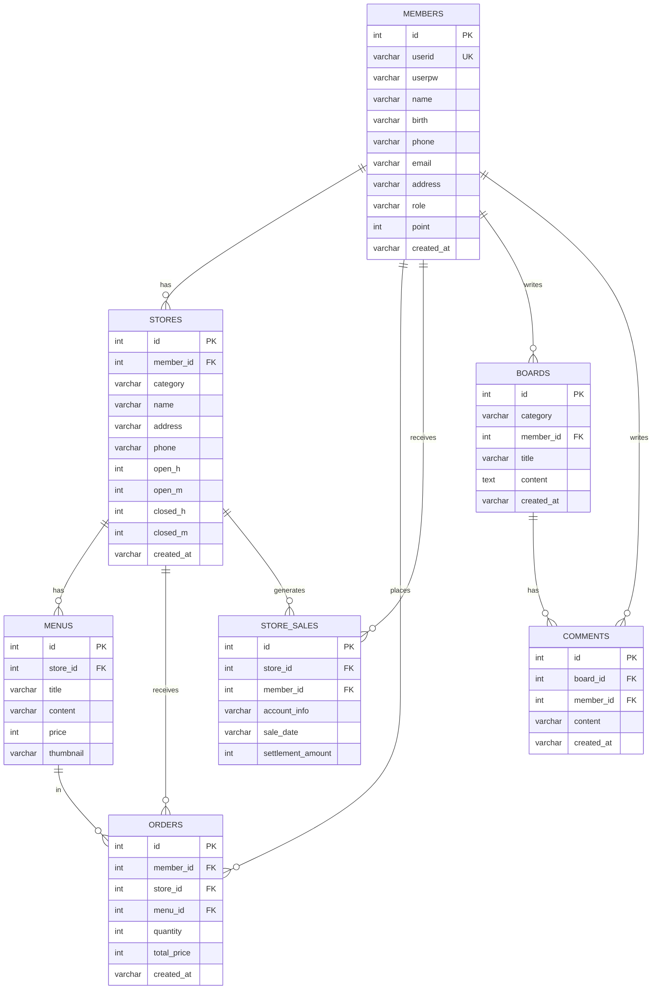
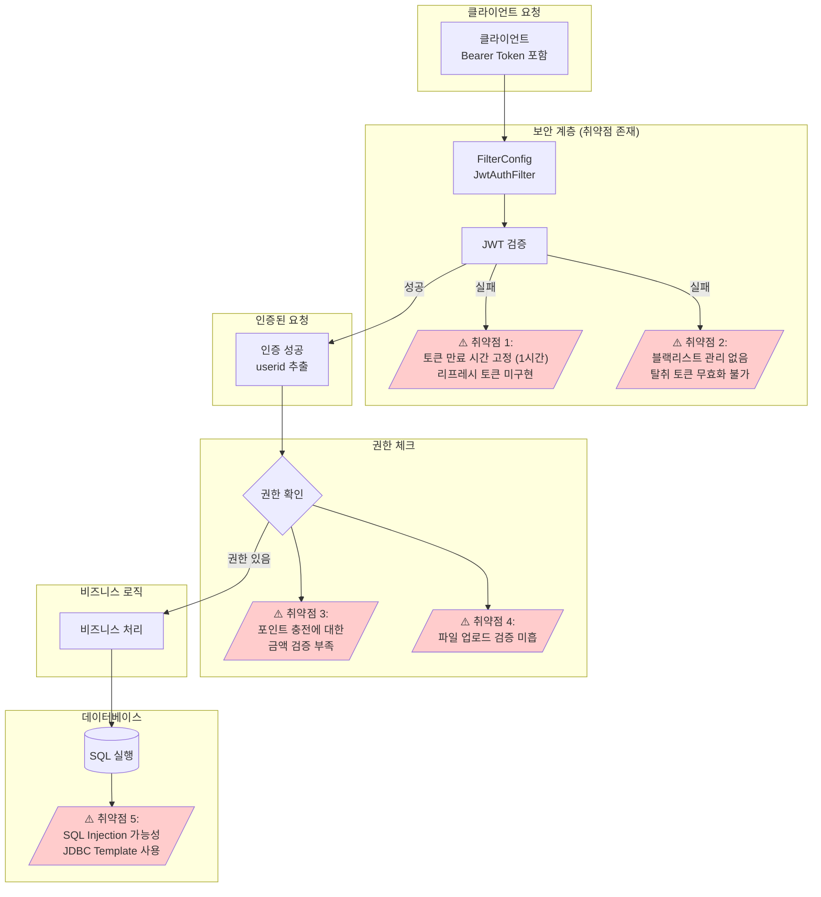

# 바로배달 아키텍처 다이어그램

## 1. 전체 시스템 아키텍처

```mermaid
graph TB
    subgraph "클라이언트 영역"
        Mobile[Mobile App<br/>사용자 주문 앱]
        WebApp[Web App<br/>Next.js<br/>가맹점 관리]
    end
    
    subgraph "API Gateway & 인증"
        Auth[인증 필터<br/>JwtAuthFilter]
        JWTUtil[JWT 유틸리티<br/>토큰 생성/검증]
    end
    
    subgraph "Application Layer - Backend"
        MC[MemberController<br/>회원 관리]
        SC[StoreController<br/>가게 관리]
        MnC[MenuController<br/>메뉴 관리]
        OC[OrderController<br/>주문 관리]
        BC[BoardController<br/>게시판]
    end
    
    subgraph "Business Logic Layer"
        MS[MemberService]
        SS[StoreService]
        MnS[MenuService]
        OS[OrderService]
        BS[BoardService]
    end
    
    subgraph "Data Access Layer"
        MR[MemberRepository]
        SR[StoreRepository]
        MnR[MenuRepository]
        OR[OrderRepository]
        BR[BoardRepository]
    end
    
    subgraph "Infrastructure"
        DB[(MariaDB<br/>데이터베이스]
        FS[FileStorage<br/>파일 저장소]
        Config[FilterConfig<br/>WebConfig]
    end
    
    Mobile -->|HTTPS| Auth
    WebApp -->|HTTPS| Auth
    
    Auth -->|토큰 검증| JWTUtil
    Auth -->|인증 성공| MC
    Auth -->|인증 성공| SC
    Auth -->|인증 성공| MnC
    Auth -->|인증 성공| OC
    Auth -->|인증 성공| BC
    
    MC --> MS
    SC --> SS
    MnC --> MnS
    OC --> OS
    BC --> BS
    
    MS --> MR
    SS --> SR
    MnS --> MnR
    OS --> OR
    BS --> BR
    
    MR --> DB
    SR --> DB
    MnR --> DB
    OR --> DB
    BR --> DB
    
    MC --> FS
    SC --> FS
    MnC --> FS
    
    Config --> Auth
    
    style Auth fill:#ffcccc
    style JWTUtil fill:#ffcccc
    style MC fill:#e1f5ff
    style SC fill:#e1f5ff
    style MnC fill:#e1f5ff
    style OC fill:#e1f5ff
    style DB fill:#ffe1e1
    style FS fill:#fff4e1
```

## 2. 데이터베이스 관계도 (ERD)



## 3. API 엔드포인트 구조

```mermaid
graph LR
    subgraph "인증 API"
        A1[POST /api/member/register<br/>회원가입]
        A2[POST /api/member/login<br/>로그인]
        A3[POST /api/member/logout<br/>로그아웃]
        A4[GET /api/member/info<br/>정보 조회]
        A5[POST /api/member/info<br/>정보 수정]
    end
    
    subgraph "포인트 API"
        P1[POST /api/member/point/add<br/>포인트 충전]
        P2[GET /api/member/point/info<br/>포인트 조회]
        P3[POST /api/member/point/info<br/>포인트 수정]
    end
    
    subgraph "가게 API"
        S1[POST /api/store/create<br/>가게 등록]
        S2[GET /api/store/all<br/>전체 조회]
        S3[GET /api/store/info/{id}<br/>정보 조회]
        S4[POST /api/store/info<br/>정보 수정]
        S5[GET /api/store/delete/{id}<br/>가게 삭제]
        S6[GET /api/store/search<br/>가게 검색]
    end
    
    subgraph "메뉴 API"
        M1[POST /api/menu/create<br/>메뉴 등록]
        M2[GET /api/menu/info/{id}<br/>메뉴 조회]
        M3[GET /api/menu/store/{storeId}<br/>가게별 메뉴 조회]
        M4[POST /api/menu/info/{id}<br/>메뉴 수정]
        M5[GET /api/menu/delete/{id}<br/>메뉴 삭제]
    end
    
    subgraph "주문 API"
        O1[POST /api/order/create<br/>주문 생성]
        O2[GET /api/order/list<br/>전체 주문 조회]
        O3[GET /api/order/{id}<br/>주문 상세]
        O4[GET /api/order/member<br/>사용자 주문 조회]
        O5[GET /api/order/store/{id}<br/>가게 주문 조회]
        O6[POST /api/order/day<br/>기간별 조회]
        O7[POST /api/order/update<br/>주문 수정]
        O8[GET /api/order/delete/{id}<br/>주문 삭제]
        O9[POST /api/order/sales<br/>매출 통계]
    end
    
    style A1 fill:#e1f5ff
    style P1 fill:#ffcccc
    style S1 fill:#fff4e1
    style M1 fill:#e1ffe1
    style O1 fill:#f4e1ff
```

## 4. 보안 계층 구조


