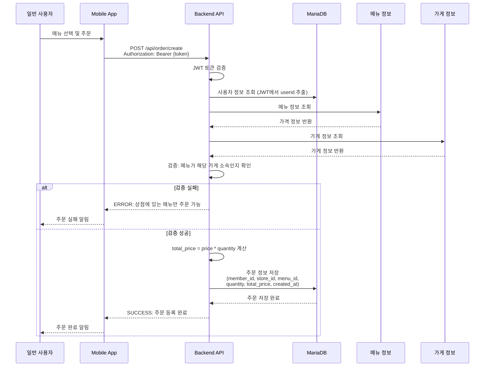
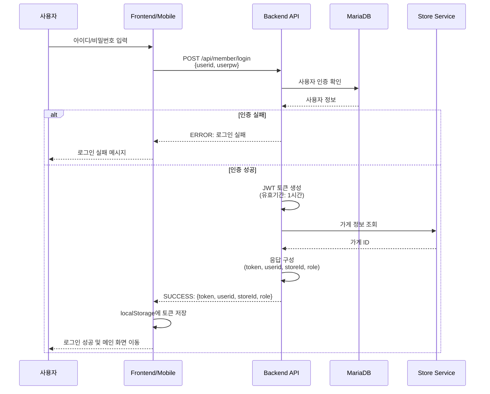
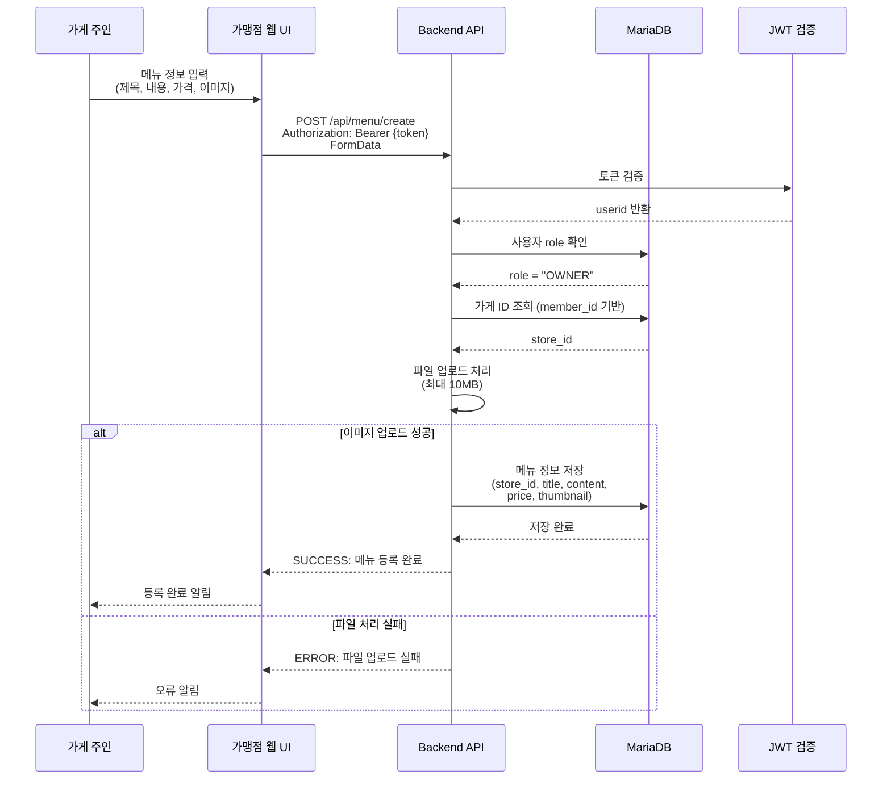
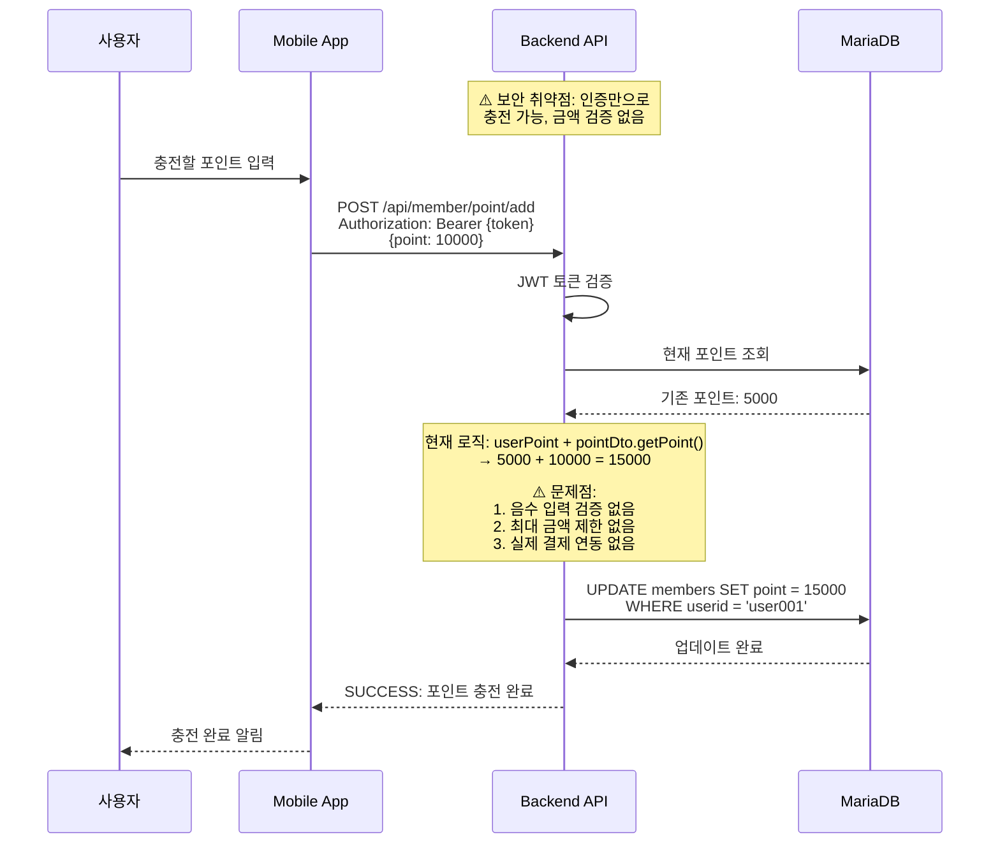
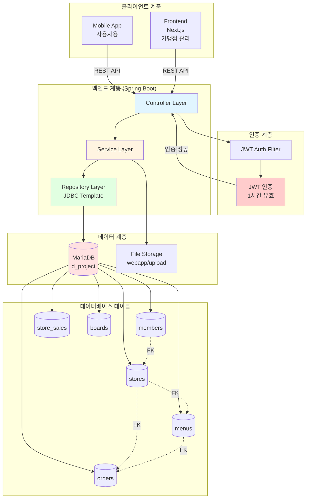

# 바로배달 시스템 흐름도

## 1. 주문 생성 시스템 흐름도

```mermaid
sequenceDiagram
    participant User as 일반 사용자
    participant Mobile as Mobile App
    participant Backend as Backend API
    participant DB as MariaDB
    participant Menu as 메뉴 정보
    participant Store as 가게 정보
    
    User->>Mobile: 메뉴 선택 및 주문
    Mobile->>Backend: POST /api/order/create<br/>Authorization: Bearer {token}
    
    Backend->>Backend: JWT 토큰 검증
    Backend->>DB: 사용자 정보 조회 (JWT에서 userid 추출)
    Backend->>Menu: 메뉴 정보 조회
    Menu-->>Backend: 가격 정보 반환
    Backend->>Store: 가게 정보 조회
    Store-->>Backend: 가게 정보 반환
    
    Backend->>Backend: 검증: 메뉴가 해당 가게 소속인지 확인
    
    alt 검증 실패
        Backend-->>Mobile: ERROR: 상점에 있는 메뉴만 주문 가능
        Mobile-->>User: 주문 실패 알림
    else 검증 성공
        Backend->>Backend: total_price = price * quantity 계산
        Backend->>DB: 주문 정보 저장<br/>(member_id, store_id, menu_id,<br/>quantity, total_price, created_at)
        DB-->>Backend: 주문 저장 완료
        Backend-->>Mobile: SUCCESS: 주문 등록 완료
        Mobile-->>User: 주문 완료 알림
    end
```

## 2. 사용자 로그인 흐름도

```mermaid
sequenceDiagram
    participant User as 사용자
    participant Frontend as Frontend/Mobile
    participant Backend as Backend API
    participant DB as MariaDB
    participant Store as Store Service
    
    User->>Frontend: 아이디/비밀번호 입력
    Frontend->>Backend: POST /api/member/login<br/>{userid, userpw}
    
    Backend->>DB: 사용자 인증 확인
    DB-->>Backend: 사용자 정보
    
    alt 인증 실패
        Backend-->>Frontend: ERROR: 로그인 실패
        Frontend-->>User: 로그인 실패 메시지
    else 인증 성공
        Backend->>Backend: JWT 토큰 생성<br/>(유효기간: 1시간)
        Backend->>Store: 가게 정보 조회
        Store-->>Backend: 가게 ID
        
        Backend->>Backend: 응답 구성<br/>(token, userid, storeId, role)
        
        Backend-->>Frontend: SUCCESS: {token, userid, storeId, role}
        Frontend->>Frontend: localStorage에 토큰 저장
        Frontend-->>User: 로그인 성공 및 메인 화면 이동
    end
```

## 3. 가게 주인이 메뉴를 등록하는 흐름도

```mermaid
sequenceDiagram
    participant Owner as 가게 주인
    participant Frontend as 가맹점 웹 UI
    participant Backend as Backend API
    participant DB as MariaDB
    participant JWT as JWT 검증
    
    Owner->>Frontend: 메뉴 정보 입력<br/>(제목, 내용, 가격, 이미지)
    Frontend->>Backend: POST /api/menu/create<br/>Authorization: Bearer {token}<br/>FormData
    
    Backend->>JWT: 토큰 검증
    JWT-->>Backend: userid 반환
    
    Backend->>DB: 사용자 role 확인
    DB-->>Backend: role = "OWNER"
    
    Backend->>DB: 가게 ID 조회 (member_id 기반)
    DB-->>Backend: store_id
    
    Backend->>Backend: 파일 업로드 처리<br/>(최대 10MB)
    
    alt 이미지 업로드 성공
        Backend->>DB: 메뉴 정보 저장<br/>(store_id, title, content,<br/>price, thumbnail)
        DB-->>Backend: 저장 완료
        Backend-->>Frontend: SUCCESS: 메뉴 등록 완료
        Frontend-->>Owner: 등록 완료 알림
    else 파일 처리 실패
        Backend-->>Frontend: ERROR: 파일 업로드 실패
        Frontend-->>Owner: 오류 알림
    end
```

## 4. 포인트 충전 시스템 흐름도 (보안 취약점 포함)

```mermaid
sequenceDiagram
    participant User as 사용자
    participant Mobile as Mobile App
    participant Backend as Backend API
    participant DB as MariaDB
    
    Note over Backend: ⚠️ 보안 취약점: 인증만으로<br/>충전 가능, 금액 검증 없음
    
    User->>Mobile: 충전할 포인트 입력
    Mobile->>Backend: POST /api/member/point/add<br/>Authorization: Bearer {token}<br/>{point: 10000}
    
    Backend->>Backend: JWT 토큰 검증
    Backend->>DB: 현재 포인트 조회
    DB-->>Backend: 기존 포인트: 5000
    
    Note over Backend: 현재 로직: userPoint + pointDto.getPoint()<br/>→ 5000 + 10000 = 15000<br/><br/>⚠️ 문제점:<br/>1. 음수 입력 검증 없음<br/>2. 최대 금액 제한 없음<br/>3. 실제 결제 연동 없음
    
    Backend->>DB: UPDATE members SET point = 15000<br/>WHERE userid = 'user001'
    DB-->>Backend: 업데이트 완료
    
    Backend-->>Mobile: SUCCESS: 포인트 충전 완료
    Mobile-->>User: 충전 완료 알림
```

## 5. 전체 시스템 아키텍처

```mermaid
graph TB
    subgraph "클라이언트 계층"
        Mobile[Mobile App<br/>사용자용]
        WebFE[Frontend<br/>Next.js<br/>가맹점 관리]
    end
    
    subgraph "인증 계층"
        JWT[JWT 인증<br/>1시간 유효]
        Filter[JWT Auth Filter]
    end
    
    subgraph "백엔드 계층 (Spring Boot)"
        Controller[Controller Layer]
        Service[Service Layer]
        Repository[Repository Layer<br/>JDBC Template]
    end
    
    subgraph "데이터 계층"
        DB[(MariaDB<br/>d_project)]
        FileStorage[File Storage<br/>webapp/upload]
    end
    
    subgraph "데이터베이스 테이블"
        Members[(members)]
        Stores[(stores)]
        Menus[(menus)]
        Orders[(orders)]
        Sales[(store_sales)]
        Boards[(boards)]
    end
    
    Mobile -->|REST API| Controller
    WebFE -->|REST API| Controller
    
    Controller --> Filter
    Filter --> JWT
    
    JWT -->|인증 성공| Controller
    Controller --> Service
    Service --> Repository
    Repository --> DB
    
    Service --> FileStorage
    
    DB --> Members
    DB --> Stores
    DB --> Menus
    DB --> Orders
    DB --> Sales
    DB --> Boards
    
    Members -.->|FK| Stores
    Stores -.->|FK| Menus
    Stores -.->|FK| Orders
    Menus -.->|FK| Orders
    
    style Controller fill:#e1f5ff
    style Service fill:#fff4e1
    style Repository fill:#e1ffe1
    style DB fill:#ffe1e1
    style JWT fill:#ffcccc
```
